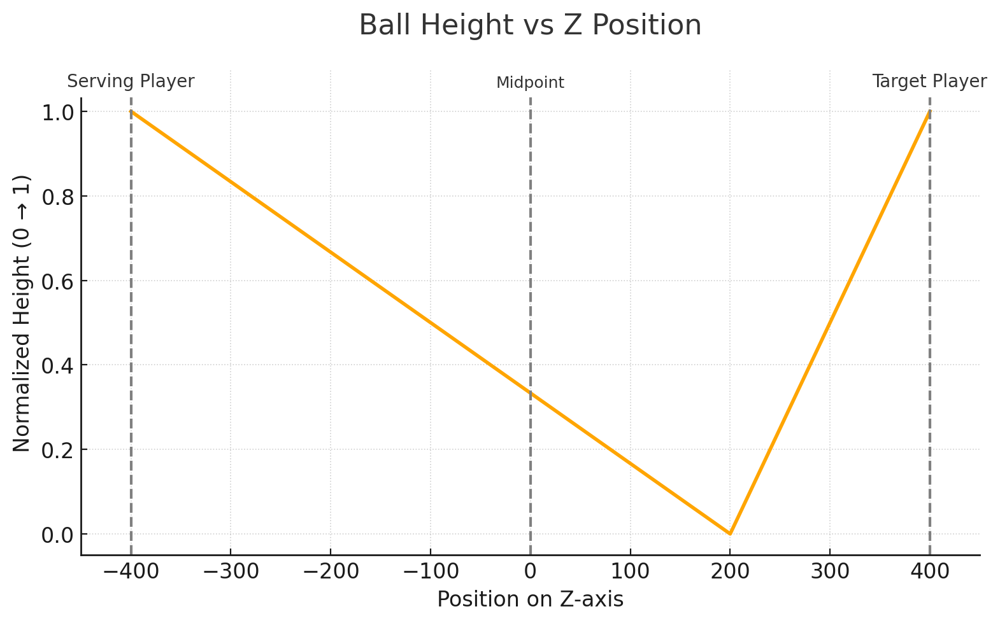

# ft_transcendence

Surprise

## Roadmap by GPT

https://chatgpt.com/share/685e81e3-cab8-8009-853b-b4dc57afca3e

## Ball Trajectory Algorithm

The ball follows a realistic ping-pong physics simulation with two distinct phases.

**Phase 1** covers the journey from the starting position (z=±400) to the bounce point (z=opposed ±200), spanning 600 units total distance.
During this phase, the ball starts at maximum height (height=1) and gradually descends to table level (height=0) as it approaches the bounce point.

**Phase 2** begins after the bounce and covers the remaining 200 units to the table edge (z=±400).
Here, the ball rises from table level (height=0) back to maximum height (height=1), simulating the natural arc after bouncing off the paddle.
The height is calculated using linear interpolation and clamped between 0 and 1 to ensure realistic motion.

*NOTE: The trajectory is still basic and will be enhanced for more realism later*

